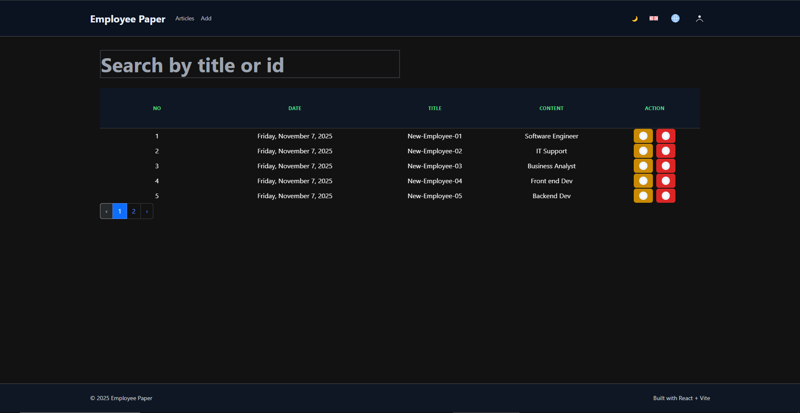

# Employee Paper — Responsive React app (Vite)

This repository contains a small single-page React application built with Vite. The app manages "employee paper" records (list, add, edit, delete) and demonstrates a lightweight layered architecture, internationalization, theme support, responsive UI, and test coverage.



## Highlights / What was done

- Layered architecture
  - A service layer centralizes HTTP calls (see `src/services/employeeService.js`).
  - Redux is used for application state with thunks in `src/store/actionCreator.js` calling the service layer.
  - Presentational components are thin and focused on rendering.

- Internationalization (i18n)
  - Added `i18next` and `react-i18next` with language detection. The app supports English and Indonesian locales.
  - Language switching is available in the header (flag selector).

- Theme and UX
  - Light/Dark theme toggle persisted to `localStorage`.
  - Responsive navigation (hamburger menu for small screens).
  - Improved SVG icons that adapt to theme colors.

- Responsive UI
  - Tailwind CSS is used across the app.
  - Employee list (`src/components/EmployeeTable.jsx`) and the Add/Edit form (`src/pages/AddEditEmployee.jsx`) are responsive with mobile-first layout.

- Tests
  - Unit tests were added for reducers and async action creators (Vitest).
  - Tests validate core behavior of state updates and service integrations.

- Docker
  - A multi-stage `Dockerfile` was added to build the app and serve the static `dist` via `nginx`.
  - See `DOCKER.md` for quick build/run instructions.

## Project structure (important files)

- `src/`
  - `main.jsx` — app bootstrap (now initializes i18n)
  - `i18n.js` — i18next initialization and language resources
  - `services/employeeService.js` — API calls (layered architecture)
  - `store/` — Redux store, action types, action creators (thunks), and reducers
  - `components/` — shared UI components (Header, EmployeeTable, icons)
  - `pages/` — page components (`Home`, `Karyawan` → renamed/migrated to `Employee` pages)

## Local development

Prerequisites:

- Node.js (v18+ recommended)
- npm (or yarn)

Install:

```powershell
npm install
```

Run the dev server:

```powershell
npm run dev
```

Open the app in your browser at the URL printed by Vite (typically `http://localhost:5173` or similar).

## Build for production

```powershell
npm run build
```

The optimized static output will be in the `dist/` folder.

## Docker (production image)

There is a multi-stage `Dockerfile` that builds the app then serves it with nginx. A simple `docker` workflow is provided in `DOCKER.md`.

Quick commands (PowerShell):

```powershell
docker build -t employee-paper:latest .
docker run -d -p 8080:80 --name employee-paper employee-paper:latest

# then open http://localhost:8080
```

Notes:

- The Docker image serves the SPA and includes an nginx config at `docker/nginx.conf` that supports client-side routing using `try_files`.

## Tests

Unit tests are run with Vitest.

Run tests:

```powershell
npm run test
```

If you add new services or change async behavior, update or add tests under `src/store` or create additional tests for components as needed.

## Linting & Formatting

This project includes ESLint and Prettier configurations to help keep code consistent and accessible. Install dev dependencies locally before running the linters:

```powershell
npm install
```

Run the linter:

```powershell
npm run lint
```

Auto-fix fixable issues:

```powershell
npm run lint:fix
```

Format with Prettier:

```powershell
npm run format
```

Notes:

- If you see an error from `npx eslint` about configuration format, ensure you installed the repo devDependencies first. I added `.eslintrc.cjs`, `.prettierrc`, and a small `.vscode/settings.json` to help with editor integration.
- The ESLint config includes `jsx-a11y` rules to help catch common accessibility issues.

## Accessibility improvements included

- Landmark roles: header (`role="banner"`), main (`role="main"`), footer (`role="contentinfo"`), and navigation regions where applicable.
- Skip-to-content link: keyboard focused users can jump directly to main content.
- Form accessibility: inputs have associated `<label for>` attributes, and form controls include `aria-invalid` where validation errors appear.
- Interactive controls: language selector and mobile menu include `aria-haspopup`, `aria-expanded`, and `aria-controls` where appropriate; action buttons include descriptive `aria-label`s.
- Table accessibility: table headers use `scope="col"`, table has an `aria-label`, and non-decorative icons are exposed properly to assistive tech.

These changes are intentionally conservative to improve keyboard and screen-reader experience without changing visible UI behavior.

## Acknowledgements

- Built with React + Vite, Tailwind CSS, Redux, i18next, and axios.
